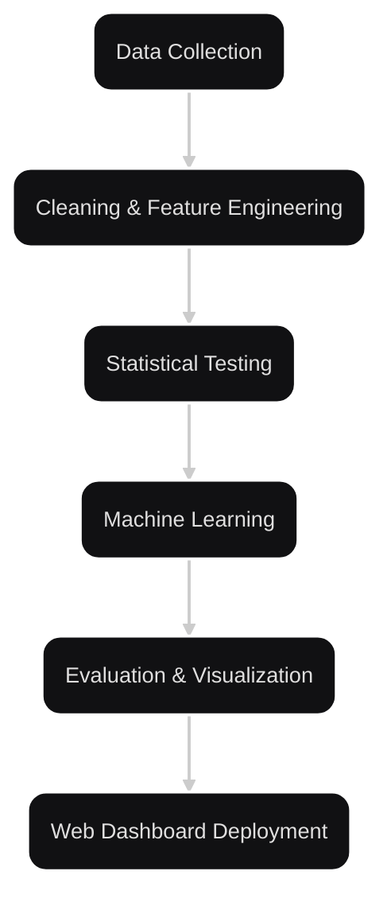

# Smoke Signals: Time Series Forecasting of PM2.5 Amid California Wildfires

This is the official repository for **"Smoke Signals"**, a CS 163 final project by Aaron
Sam and Jonathan Manzano. This project analyzes PM2.5 levels during California wildfires
to forecast air quality and identify key environmental factors. The findings are
presented in an interactive web dashboard.

**Live Website**: [https://smoke-signals-pmgnn-457202.uw.r.appspot.com/analytics]

---

## Project Overview

Our goal is to investigate how wildfire events impact PM2.5 levels and forecast air
quality using advanced time series models.
We:

- Perform statistical analysis and feature engineering
- Train multiple GNN models
- Visualize temporal and spatial trends
- Deploy results in an interactive Dash web application

---

## Data Source & Citation

Our data was collected from the following sources:

- **[California Air Resources Board (CARB)](https://ww2.arb.ca.gov/)**
- **[U.S. EPA Air Quality System (AQS)](https://www.epa.gov/aqs)**
- **[ERA5 Reanalysis (ECMWF)](https://cds.climate.copernicus.eu/datasets/reanalysis-era5-single-levels?tab=overview)**

Please cite the following if using the dataset:

> Liao, K., Buch, J., Lamb, K. D., & Gentine, P.
> "Simulating the air quality impact of prescribed fires using graph neural network-based PM2.5 forecasts."
> Environmental Data Science, 2025.

> Liao, K.
> "PM2.5_Forecasting_GNN."
> GitHub, 2023.
> [https://github.com/kyleenliao/PM2.5_Forecasting_GNN](https://github.com/kyleenliao/PM2.5_Forecasting_GNN).

---

## Setup Instructions

### Prerequisites

- Python 3.12+
- Google Cloud SDK (for deployment)
- Git installed

### Dataset

[Google Drive](https://drive.google.com/drive/folders/169sQejuCSerU1GWPgANJXkBZ1-2a8Vdn?usp=sharing)

### Install Dependencies

Clone the repo and install required packages:

```shell
git clone https://github.com/your-username/smoke-signals.git
cd smoke-signals
python -m venv env
source env/bin/activate  # On Windows: .\env\Scripts\activate
pip install -r requirements.txt
```

### Run Locally

```shell
cd app/
python app.py
```

### Testing the Setup

To ensure the web application and model code run correctly:

1. Run webapp.py and confirm Dash loads on
[http://127.0.0.1:8050](http://127.0.0.1:8050).
2. Open model.py and run it to test the forecasting pipeline and view printed metrics.
3. Ensure your environment has access to BigQuery if fetching live data.

## Project Pipeline



## Pipeline Component Breakdown

Each stage of our pipeline is modular and purpose-built to support clear
experimentation, fast iteration, and seamless deployment.

### 1. Data Collection

- **Source**: 
- **Scope**:
- **Automation**: Queried and filtered with BigQuery to ensure relevant, high-quality
  data for modeling

### 2. Data Cleaning & Feature Engineering

- **Structured Features**: Meteorological (temperature, surface pressure, precipitation,
  frp), PM2.5, cities and timestamp
- **Feature Engineering**:
    - Created a AQI categorical column
    - Converted numpy files to a csv file

### 3. Statistical Testing

- **Tests Used**: Chi-squared tests
- **Purpose**: Validate the significance of key features before modeling
- **Visuals**: Feature Importance chart and Correlation Heatmaps

### 4. Model Training

- **Baseline Model**: Random Forest Classifier for explainability and benchmarking
- **Advanced Model**: Graph neural network to predict PM2.5 levels
- **Data Configurations**:
- **Evaluation**: Compared predicted to the observed PM2.5 levels

### 5. Visualization & Analysis

- **Libraries**: Plotly, Seaborn, Folium, Dash, Scipy
- **Visualizations**:
    - Time Series Forecasting
    - Interactive map of sensors
    - Heatmaps of Meteorological data
    - Feature importance comparisons
- **Widgets**: Precision-adjustable Folium maps for mapping

### 6. Web Dashboard Deployment

- **Frontend**: Modular layout using Dash components (`pages/`, `nav_bar.py`)
- **Backend**: Python with Dash callbacks and plotting logic (`components/`)
- **Hosting**: Google App Engine (`app.yaml` handles configuration)
- **Structure**: Four main pages — Home, Objectives, Methodology, Findings — plus
  reusable assets and styles

---

### Deploy to Google App Engine

```bash
gcloud app deploy
```

Make sure your Google Cloud project is set up and authenticated locally using:

```bash
gcloud auth login
gcloud config set project [YOUR_PROJECT_ID]
```

### Repository Structure

```plaintext
smoke-signals/
├── app/
│   ├── components/
│   │   ├── nav_bar.py             # Reusable navigation bar
│   │   ├── graphs.py              # graphs for site
│   │   └── time_series.py         # time series graphs
│   ├── modules/
│   │     ├── data_loader.py
│   │     └── utils.py
│   ├── assets/
│   │   └── [styles.css]           # Styling   
│   │                        (colors,spacing,layout dicts)
│   ├── pages/
│   │   ├── home.py                # Homepage content
│   │   ├── analytics.py           # Main research findings 
│   │   │                          and visualizations
│   │   └── proposal.py            # Project goals and 
│   │                              broader impact
│   │
│   │ 
│   ├── app.py                  # Main Dash entry point
│   ├── requirements.txt           # Project dependencies
│   └── app.yaml                   # Google App Engine deployment config
│
├── model/
│   └── model.py                   # ARIMA, LSTM, and GNN pipelines
│
└── data/                          # (Optional) Sample processed datasets

```

---

## Key Files

| File/Dir                  | Description                                                         |
|---------------------------|---------------------------------------------------------------------|
| `app/app.py`              | Launches the Dash web app                                           |
| `app/pages/`              | Pages: `home.py`, `analytics.py`, `proposal.py`                     |
| `app/visuals/analysis.py` | All Dash charts, maps, and visual logic                             |
| `model/model.py`          | ML models: TF-IDF + PyTorch NN, Random Forests, feature engineering |
| `app/requirements.txt`    | List of Python packages                                             |
| `app/app.yaml`            | App Engine configuration for deployment                             |
|

## Key Features

- Time Series Forecasting: Uses GNNs for accurate PM2.5 predictions
- Graph Neural Networks: Leverages spatial relationships between monitoring stations for
  improved forecasting.
- Interactive Visualizations: Includes time series plots, seasonal decomposition, and
  spatial heatmaps.
- Modular Dash Layout: Each section of the site (Home, Objectives, Findings) is rendered
  via individual Dash pages.
- Cloud Deployment: Fully deployed to Google Cloud Platform using App Engine, with
  configuration managed by app.yaml.

---

## Authors

- Jonathan Manzano
- Aaron Sam

