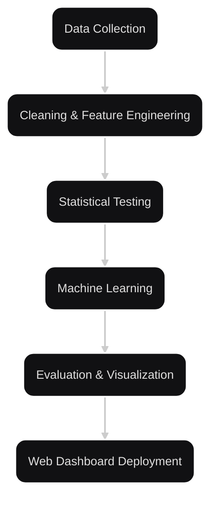

# Smoke Signals: Time Series Forecasting of PM2.5 Amid California Wildfires


[](https://github.com/astral-sh/uv)
[](https://cookiecutter-data-science.drivendata.org/)

This is the official repository for **"Smoke Signals"**,
a CS 163 capstone project by Jonathan Manzano and Aaron Sam.
This project analyzes PM2.5 levels during California wildfires
to forecast air quality and identify key environmental factors.
The findings are presented in an interactive web dashboard.

**Live Website**:
[Smoke Signals](https://smoke-signals-pmgnn-457202.uw.r.appspot.com)

---

## Project Overview

Our goal is to investigate how wildfire events impact PM2.5 levels
and forecast air quality using advanced time series models.
We:

- Perform statistical analysis and feature engineering
- Train multiple GNN models
- Visualize temporal and spatial trends
- Deploy results in an interactive Dash web application

---

## Data Source & Citation

Our data was collected from the following sources:

- **[California Air Resources Board—CARB](https://ww2.arb.ca.gov/)**
- **[U.S. EPA Air Quality System—AQS](https://www.epa.gov/aqs)**
- **[ERA5 Reanalysis—ECMWF](https://cds.climate.copernicus.eu/datasets/reanalysis-era5-single-levels?tab=overview)**

Please cite the following if using the dataset:

> Liao, K., Buch, J., Lamb, K. D., & Gentine, P.
> "Simulating the air quality impact of prescribed fires using graph neural
> network-based PM2.5 forecasts."
> Environmental Data Science, 2025.
> [https://doi.org/10.1017/eds.2025.4](https://doi.org/10.1017/eds.2025.4)

> Liao, K.
> "PM2.5_Forecasting_GNN."
> GitHub, 2023.
> [https://github.com/kyleenliao/PM2.5_Forecasting_GNN](https://github.com/kyleenliao/PM2.5_Forecasting_GNN).

---

## Setup Instructions

### Prerequisites

- Python 3.12+
- Google Cloud SDK (for deployment)
- Git installed

### Dataset

[Google Drive](https://drive.google.com/drive/folders/169sQejuCSerU1GWPgANJXkBZ1-2a8Vdn?usp=sharing)

### Install Dependencies

This repo uses [uv](https://docs.astral.sh/uv/) to manage dependencies.

```shell
uv sync
```

### Run Locally

```shell
cd app/
python app
```

### Testing the Setup

To ensure the web application and model code run correctly:

1. Run webapp.py and confirm Dash loads on
   [http://127.0.0.1:8050](http://127.0.0.1:8050).
2. Open model.py and run it to test the forecasting pipeline and view printed metrics.
3. Ensure your environment has access to BigQuery if fetching live data.

---

## Deploy to Google App Engine

```shell
gcloud app deploy
```

Make sure your Google Cloud project is set up and authenticated locally using:

```shell
gcloud auth login
gcloud config set project [YOUR_PROJECT_ID]
```

---

## Project Pipeline



## Pipeline Component Breakdown

Each stage of our pipeline is modular and purpose-built to support clear
experimentation, fast iteration, and seamless deployment.

### 1. Data Collection

- **Source**:
  [PM2.5_Forecasting_GNN](https://github.com/kyleenliao/PM2.5_Forecasting_GNN)
- **Automation**: Queried and filtered with BigQuery to ensure relevant, high-quality
  data for modeling

### 2. Data Cleaning & Feature Engineering

- **Structured Features**: Meteorological (temperature, surface pressure, precipitation,
  frp), PM2.5, cities and timestamp
- **Feature Engineering**:
    - Created a AQI categorical column
    - Converted numpy files to a csv file

### 3. Statistical Testing

- **Baseline Model**: Random Forest Classifier for explainability and benchmarking
- **Tests Used**: Chi-squared tests
- **Purpose**: Validate the significance of key features before modeling
- **Visuals**: Feature Importance chart

### 4. Model Training

- **Total PM2.5 GNN**:
  This neural network combines meteorological data with fire
  activity variables to forecast combined ambient and wildfire PM2.5 levels.
- **Ambient-Only GNN**:
  The GNN architecture was trained only on meteorological factors,
  with no input from fires,
  to predict background PM2.5 levels based on weather patterns.
- **Graph Construction & Temporal Encoding**:
  Stations are considered as network nodes connected by geographic proximity edges.
  Each model uses fixed-length temporal windows (e.g., past 6 hours) to quantify
  persistence and trends.
- **Optimization & Evaluation**: Both networks minimize mean squared error using Adam
  $ (\text{LR} = 1 \times 10^{-3}, \text{batch} = 32) $ across $100 \; \text{epochs}$.
  Performance is compared via $\text{RMSE}$ and $\text{R}^2$,
  with the Total model significantly outperforming during big wildfire outbreaks.

### 5. Visualization & Analysis

- **Libraries**: Plotly, Seaborn, Folium, Dash, Scipy
- **Visualizations**:
    - Time Series Forecasting
    - Interactive map of sensors
    - Heatmaps of Meteorological data
    - Feature importance comparisons
- **Widgets**: Precision-adjustable Folium maps for mapping

### 6. Web Dashboard Deployment

- **Frontend**: Modular layout using Dash components (`pages/`, `nav_bar.py`)
- **Backend**: Python with Dash callbacks and plotting logic (`components/`)
- **Hosting**: Google App Engine (`app.yaml` handles configuration)
- **Structure**: Four main pages: Home, Objectives, Methodology, & Findings

## Repository Structure

```text
smoke-signals/
├── app/
│   ├── assets/
│   │   ├── *.css               # Styling (colors,spacing,layout dicts)
│   │   ├── *.html              # Reusable navigation bar
│   │   └── *.[jpg/png/webp]    # Images
│   │
│   ├── components/
│   │   ├── __init__.py
│   │   ├── corr_heatmap.py     # Reusable navigation bar
│   │   ├── graphs.py           # Graphs for site
│   │   ├── nav_bar.py          # Reusable navigation bar
│   │   └── time_series.py      # Time series graphs
│   │
│   ├── modules/
│   │   ├── __init__.py
│   │   ├── data_loader.py      # Script to pull data from Google Cloud
│   │   └── utils.py            # Helper Script for data_loader.py
│   │
│   ├── pages/
│   │   ├── __init__.py
│   │   ├── analytics.py        # Main research findings and visualizations
│   │   ├── home.py             # Homepage content
│   │   ├── methodology.py      # Methodology used in experiment
│   │   └── proposal.py         # Project goals and broader impact
│   │
│   ├── .gcloudignore           # Google Cloud ignore
│   ├── app.py                  # Main Dash entry point
│   └── app.yaml                # Google App Engine deployment config
│
├── data/                       # Store dataset from Google Drive Here
│
├── models/                     # Where to store trained PM2.5 GNN Weights
│
├── notebooks/                  # Jupyter Notebooks of machine learning process
│
├── pm25gnn/                    # Modified clone of PM2.5 Forcasting Repo
│
└── smoke_signals/              # Smoke Signals Module
```

---

## Key Files

| File/Dir                    | Description                                       |
|-----------------------------|---------------------------------------------------|
| `app/app.py`                | Launches the Dash web app                         |
| `app/app.yaml`              | App Engine configuration for deployment           |
| `notebooks/`                | Contains the different phases of machine learning |
| `pm25gnn/model/PM25_GNN.py` | Model: Graph Neural Network trained on PM2.5      |

### Notebook Key

`X-YY-AAA-[description-of-notebook].ipynb`

- `X-YY`: `PHASE-NOTEBOOK`.
  `NOTEBOOK` is just the Nth notebook in that phase to be created.
  For phases of the project,
  we generally use a scheme like the following:
  - `0`:
    Data Exploration
  - `1`:
    Data cleaning and Feature Creation -
    Data Cleaning and Feature Creation -
    often writes data to `data/processed`
  - `2`: Modeling -
    training machine learning models
- `AAA`: Authors Initials

## Key Features

- Time Series Forecasting:
  Uses GNNs for accurate PM2.5 predictions
- Graph Neural Networks:
  Leverages spatial relationships between monitoring stations for improved forecasting.
- Interactive Visualizations:
  Includes time series plots.
- Modular Dash Layout:
  Each section of the site (Home, Objectives, Findings)
  is rendered via individual Dash pages.
- Cloud Deployment:
  Fully deployed to Google Cloud Platform using App Engine,
  with configuration managed by app.yaml.

---

## Authors

- [Jonathan Manzano](https://github.com/jonathan-manzano)
- [Aaron Sam](https://github.com/Aaron1376)
